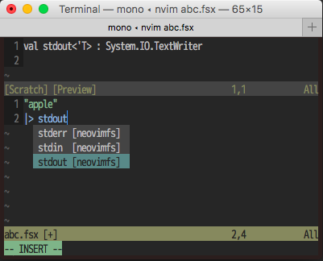

# deoplete-fsharp

F# support for Neovim

using [deopletefs](https://github.com/callmekohei/deopletefs), [quickrunfs](https://github.com/callmekohei/quickrunfs)

## Like this

auto-completion



run


## Installing

deoplete-fsharp requires mono and FSharp installed.

installing with dein.vim
```vim
call dein#add('Shougo/deoplete.nvim')
call dein#add('callmekohei/deoplete-fsharp', {'build': 'bash install.bash'})
```

## Configuration
```vim
let g:deoplete#enable_at_startup = 1
```

## How to run
```
: w
: QUICKRUNfs
```

<br>
<br>


## LICENCE  
The MIT License (MIT)
