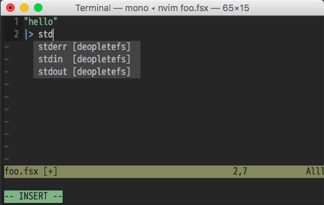

[](https://github.com/callmekohei/deoplete-fsharp/blob/master/LICENSE)


[](https://gitter.im/fsugjp/public)


# deoplete-fsharp

F# support for Vim8 / Neovim

using [deopletefs](https://github.com/callmekohei/deopletefs)

## Auto-completion



## Installing

deoplete-fsharp requires mono and FSharp installed.

installing with dein.vim
```vim
call dein#add('Shougo/deoplete.nvim')
call dein#add('callmekohei/deoplete-fsharp', {'build': 'bash install.bash'})
```

## Configuration
```vim
let g:deoplete#enable_at_startup = 1
```


## How to Run

( require plugins )
```
thinca/vim-quickrun
Shougo/vimproc.vim
```

( dein.toml setting )
```toml

[[plugins]]
repo = 'Shougo/vimproc.vim'
build = 'make'

[[plugins]]
repo = 'thinca/vim-quickrun'
hook_add = '''
    set splitright
    let g:quickrun_config = {
    \
    \     '_' : {
    \           'runner'                          : 'vimproc'
    \         , 'runner/vimproc/updatetime'       : 60
    \         , 'hook/time/enable'                : 1
    \         , 'hook/time/format'                : "\n*** time : %g s ***"
    \         , 'hook/time/dest'                  : ''
    \         , "outputter/buffer/split"          : 'vertical'
    \         , 'outputter/buffer/close_on_empty' : 1
    \     }
    \
    \     , 'fsharp' : {
    \           'command'                         : 'fsharpi --readline-'
    \         , 'tempfile'                        : '%{tempname()}.fsx'
    \         , 'runner'                          : 'concurrent_process'
    \         , 'runner/concurrent_process/load'  : '#load "%S";;'
    \         , 'runner/concurrent_process/prompt': '> '
    \     }
    \ }
```
( How to run ( QuickRun ) )
```
: w
: QuickRun
```
## How to Test

nuget `Persimmon.Script`
```
nuget Persimmon.Script
```
code following
```fsharp
/// require Persimmon libraries and open modules.
#r "./packages/Persimmon/lib/net45/Persimmon.dll"
#r "./packages/Persimmon.Runner/lib/net40/Persimmon.Runner.dll"
#r "./packages/Persimmon.Script/lib/net45/Persimmon.Script.dll"

open Persimmon
open UseTestNameByReflection
open System.Reflection

/// write your test code here.
let ``a unit test`` = test {
  do! assertEquals 1 2
}

/// print out test report.
new Persimmon.ScriptContext()
|> FSI.collectAndRun( fun _ -> Assembly.GetExecutingAssembly() )

```
do test
```
: w
: QUICKRUNfs
```
