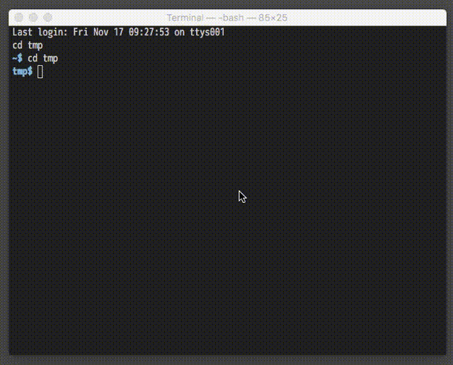
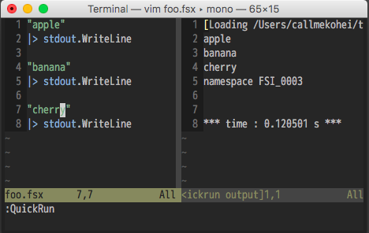
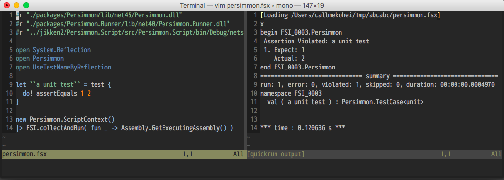

[](https://github.com/callmekohei/deoplete-fsharp/blob/master/LICENSE)
[](https://gitter.im/fsugjp/public)




# deoplete-fsharp

[deoplete.nvim](https://github.com/Shougo/deoplete.nvim) source for F#  
Using [deopletefs](https://github.com/callmekohei/deopletefs) that is command-line interface to the [FSharp.Compiler.Service](https://github.com/fsharp/FSharp.Compiler.Service).  
It's useful to write a small code in F# script file ( .fsx ) .

## Install

deoplete-fsharp requires [mono](https://github.com/mono/mono) and [fsharp](https://github.com/fsharp/fsharp) installed.

Vim
```
// download vim plugins
$ git clone --depth 1 https://github.com/callmekohei/deoplete-fsharp
$ git clone --depth 1 https://github.com/roxma/nvim-yarp
$ git clone --depth 1 https://github.com/roxma/vim-hug-neovim-rpc

// do install command
$ cd ./deoplete-fsharp/
$ bash install.bash ( or install.cmd )

// set runtimepath
$ vim .vimrc
    set runtimepath+=/path/to/deoplete-fsharp
    set runtimepath+=/path/to/nvim-yarp
    set runtimepath+=/path/to/vim-hug-neovim-rpc
```

NeoVim
```
// download vim plugins
$ git clone --depth 1 https://github.com/callmekohei/deoplete-fsharp

// do install command
$ cd ./deoplete-fsharp/
$ bash install.bash ( or install.cmd )

// set runtimepath
$ vim .vimrc
    set runtimepath+=/path/to/deoplete-fsharp
```

Example of deoplete setting ( my setteing )

```vim
" .vimrc ( or init.vim )
call deoplete#custom#option({
\ 'auto_complete_delay': 0,
\ 'ignore_case': v:true,
\ })
```

---


# More info. for F# script file

## Run



### Requires plugins  
[vim-quickrun](https://github.com/thinca/vim-quickrun)  
[vimproc.vim](https://github.com/Shougo/vimproc.vim)

### Install and build
```
// download vim plugins
$ git clone --depth 1 https://github.com/thinca/vim-quickrun
$ git clone --depth 1 https://github.com/Shougo/vimproc.vim

// build vimproc
$ cd ./vimproc/
$ make

// set runtimepath
$ vim .vimrc
    set runtimepath+=/path/to/vim-quickrun
    set runtimepath+=/path/to/vimproc.vim
```

### Example of vim-quickrun setting ( my setteing )
```vim
" .vimrc ( or init.vim )
let g:quickrun_config = {}

let g:quickrun_config._ = {
    \  'runner'                          : 'vimproc'
    \ ,'runner/vimproc/updatetime'       : 60
    \ ,'hook/time/enable'                : 1
    \ ,'hook/time/format'                : "\n*** time : %g s ***"
    \ ,'hook/time/dest'                  : ''
    \ ,"outputter/buffer/split"          : 'vertical'
    \ ,'outputter/buffer/close_on_empty' : 1
\}

let g:quickrun_config.fsharp = {
    \  'command'                         : 'fsharpi --readline-'
    \ ,'tempfile'                        : '%{tempname()}.fsx'
    \ ,'runner'                          : 'concurrent_process'
    \ ,'runner/concurrent_process/load'  : '#load "%S";;'
    \ ,'runner/concurrent_process/prompt': '> '
\}
```
If you use window's Vim / Neovim
```
'command': 'mono "path\to\fsi.exe" --readline-'
```

### Run F# script file
```
: w
: QuickRun
```

## Test



### Requires plugins  
[Persimmon.Script](https://github.com/persimmon-projects/Persimmon.Script)

### Install ( requires [Paket](https://github.com/fsprojects/Paket) )
```
// make foo folder and move to foo folder
$ mkdir foo/
$ cd foo/

// install Persimmon.Script
$ paket init
$ vim paket.dependencies
    source https://www.nuget.org/api/v2
    generate_load_scripts: true
    nuget persimmon.script
$ paket install
```

### Test F# script file
```
: w
: QuickRun
```

### Sample code
```fsharp
#load "./.paket/load/net471/main.group.fsx"

open Persimmon
open UseTestNameByReflection
open System.Reflection

/// write your test code here.
let ``a unit test`` = test {
  do! assertEquals 1 2
}

/// print out test report.
new Persimmon.ScriptContext()
|> FSI.collectAndRun( fun _ -> Assembly.GetExecutingAssembly() )
```
