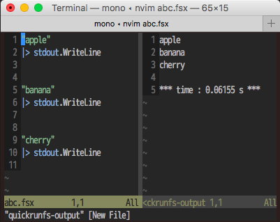

[](https://github.com/callmekohei/deoplete-fsharp/blob/master/LICENSE)


# deoplete-fsharp

F# support for Neovim

using [deopletefs](https://github.com/callmekohei/deopletefs), [quickrunfs](https://github.com/callmekohei/quickrunfs)

## Like this

Auto-completion


Run



Test ( requires [Persimmon.Script](https://preview.nuget.org/packages?q=persimmon.Script) )


## Installing

deoplete-fsharp requires mono and FSharp installed.

installing with dein.vim
```vim
call dein#add('Shougo/deoplete.nvim')
call dein#add('callmekohei/deoplete-fsharp', {'build': 'bash install.bash'})
```

## Configuration
```vim
let g:deoplete#enable_at_startup = 1
```

## How to run
```
: w
: QUICKRUNfs
```

## How to test

nuget `Persimmon.Script`
```
nuget Persimmon.Script
```
code following
```fsharp
/// require Persimmon libraries and open modules.
#r "./packages/Persimmon/lib/net45/Persimmon.dll"
#r "./packages/Persimmon.Runner/lib/net40/Persimmon.Runner.dll"
#r "./packages/Persimmon.Script/lib/net45/Persimmon.Script.dll"
open Persimmon
open UseTestNameByReflection
open System.Reflection

/// write your test code here.
let myTest = test {
    do! assertEquals 1 2
}

/// print out test report.
Script.testReport( fun _ -> Assembly.GetExecutingAssembly() )
|> stdout.WriteLine
```
do test
```
: w
: QUICKRUNfs
```


